# Mundix Security 360 — Arquitetura Técnica

> **Versão 1.0 — Maio 2026**
> **Status:** Planejamento → Build
> **Ambiente:** Ubuntu 24.04 LTS, Proxmox LXC, Mini PC com 6 NICs
> **Licença do projeto:** 100% Open Source (MIT / Apache 2.0 / GPL / BSD compatíveis)

---

## Sumário

1. [Visão Geral e Objetivos](#1-visão-geral-e-objetivos)
2. [Stack Tecnológica](#2-stack-tecnológica)
3. [Topologia de Rede](#3-topologia-de-rede)
4. [Dual-WAN: ECMP, Failover e BFD](#4-dual-wan-ecmp-failover-e-bfd)
5. [Firewall e IPS (nftables + Suricata)](#5-firewall-e-ips-nftables--suricata)
6. [Defesa Técnica nftables](#6-defesa-técnica-nftables)
7. [DNS e DHCP](#7-dns-e-dhcp)
8. [Telemetria e Observabilidade](#8-telemetria-e-observabilidade)
9. [SIEM e XDR](#9-siem-e-xdr)
10. [DLP — Detecção de Dados Sensíveis](#10-dlp--detecção-de-dados-sensíveis)
11. [Automação e IaC](#11-automação-e-iac)
12. [Compliance LGPD/ANPD](#12-compliance-lgpdanpd)

---

## 1. Visão Geral e Objetivos

### Missão

O **Mundix Security 360** é uma solução unificada de segurança, visibilidade e compliance de rede, construída sobre software livre, voltada para PMEs brasileiras (~50 usuários, ~70 dispositivos).

### Objetivos Principais

| Objetivo | Descrição |
|----------|-----------|
| **Defesa em profundidade** | Múltiplas camadas: firewall, IPS, DLP, WAF, autenticação |
| **Visibilidade total** | Logs estruturados, fluxo de rede, alertas em tempo real |
| **Zero vendor lock-in** | 100% open source, dados portáveis (S3/JSON/Parquet) |
| **Compliance LGPD** | Retenção legal, pseudonimização, trilha de auditoria imutável |
| **Alta disponibilidade** | Dual-WAN, failover automático, backup criptografado off-site |
| **Gestão unificada** | Dashboard único (Next.js) para todas as funções |

### Não-Objetivos (fora do escopo v1)

- Suporte multi-tenant
- Proxy transparente para HTTPS (apenas SNI filtering)
- Gateway de email próprio (usa relay externo)
- Antivírus de endpoint em tempo real (Wazuh cobre file integrity)

---

## 2. Stack Tecnológica

Todos os componentes são 100% open source. Licenças: MIT, Apache 2.0, GPL, BSD, MPL-2.0.

### Camada de Rede

| Componente | Função | Licença |
|-----------|--------|---------|
| **nftables** | Firewall stateful (kernel) | GPL-2.0 |
| **Suricata 7.x** | IPS/IDS/NSM | GPL-2.0 |
| **dnsmasq** | DNS + DHCP | GPL-3.0 |
| **FRRouting (FRR)** | BGP/OSPF/ECMP routing | GPL-2.0 |
| **Keepalived/VRRP** | HA para gateway (futuro) | GPL-2.0 |

### Telemetria e Observabilidade

| Componente | Função | Licença |
|-----------|--------|---------|
| **Akvorado** | NetFlow/sFlow collector | Apache-2.0 |
| **VictoriaMetrics** | Time-series database (TSDB) | Apache-2.0 |
| **Grafana OSS** | Visualização e dashboards | AGPL-3.0 |
| **OpenTelemetry Collector** | Métricas, traces, logs | Apache-2.0 |
| **Vector** | Log shipper/enricher | MPL-2.0 |
| **Loki** | Log aggregation (Grafana stack) | AGPL-3.0 |

### SIEM e XDR

| Componente | Função | Licença |
|-----------|--------|---------|
| **Wazuh** | SIEM/XDR, file integrity, HIDS | GPL-2.0 |
| **ClickHouse** | Analytics OLAP para eventos | Apache-2.0 |
| **Sigma rules** | Detecção de ameaças | MIT |

### Segurança e Autenticação

| Componente | Função | Licença |
|-----------|--------|---------|
| **Keycloak** | IAM / SSO / OIDC / SAML | Apache-2.0 |
| **OpenBao** | Secrets management (Vault fork) | MPL-2.0 |
| **Nginx/Traefik** | Reverse proxy / TLS termination | MIT/Apache |
| **ModSecurity** | WAF (Web Application Firewall) | Apache-2.0 |

### Dados e Armazenamento

| Componente | Função | Licença |
|-----------|--------|---------|
| **Valkey** | Cache e fila (Redis fork) | BSD-3 |
| **MinIO** | Object storage (S3-compatible) | AGPL-3.0 |
| **PostgreSQL** | Banco relacional principal | PostgreSQL License |
| **Restic** | Backup criptografado | BSD-2 |

### Automação e Deploy

| Componente | Função | Licença |
|-----------|--------|---------|
| **Ansible** | Configuration management | GPL-3.0 |
| **Podman** | Container runtime (daemonless) | Apache-2.0 |
| **Traefik** | Ingress / reverse proxy | MIT |
| **tmux** | Session persistence | ISC |

### IA e Inteligência

| Componente | Função | Licença |
|-----------|--------|---------|
| **LiteLLM** | Proxy de APIs LLM (OpenRouter) | MIT |
| **OpenRouter API** | Geração de texto/análise | API paga |
| **LangChain** | Orquestração de agentes | MIT |

### Frontend (Dashboard Unificado)

| Componente | Função | Licença |
|-----------|--------|---------|
| **Next.js** | Framework React | MIT |
| **Shadcn/ui** | Componentes UI | MIT |
| **Zustand** | State management | MIT |
| **tRPC** | API type-safe | MIT |


---

## 3. Topologia de Rede

### Arquitetura Física

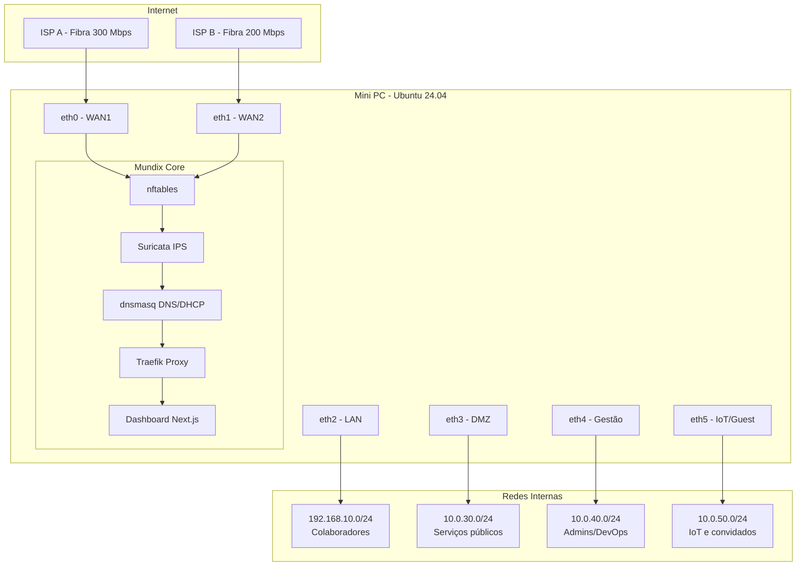

### VLANs e Segregação

| Interface | VLAN | Subnet | Função | Prioridade |
|-----------|------|--------|--------|------------|
| eth0 | WAN | DHCP ISP | Internet A (primária) | Alta |
| eth1 | WAN | DHCP ISP | Internet B (secundária) | Alta |
| eth2 | 10 | 192.168.10.0/24 | LAN — Colaboradores | Alta |
| eth3 | 30 | 10.0.30.0/24 | DMZ — Web servers, API | Média |
| eth4 | 40 | 10.0.40.0/24 | Gestão — Admins/DevOps | Crítica |
| eth5 | 50 | 10.0.50.0/24 | IoT/Guest — Dispositivos IoT | Baixa |

### Fluxo de Tráfego

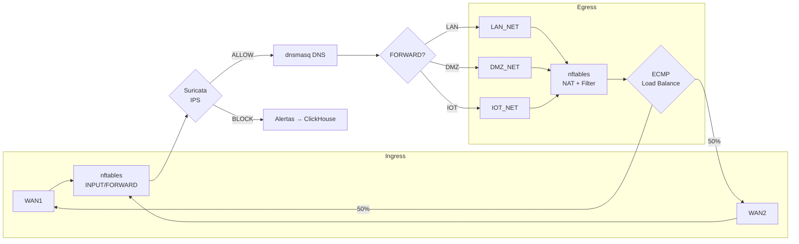


---

## 4. Dual-WAN: ECMP, Failover e BFD

### Objetivo

Garantir alta disponibilidade de internet através de duas conexões ISP independentes, com balanceamento de carga round-robin e failover automático em caso de falha.

### Arquitetura ECMP

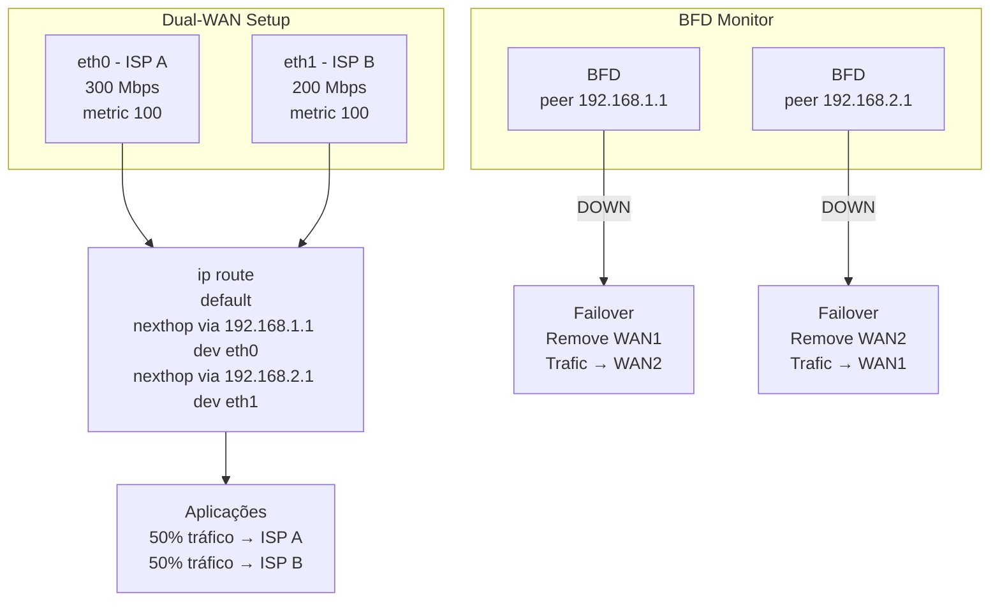

### Configuração IP Routes

```bash
# Adicionar default routes com ECMP (Equal Cost Multi-Path)
ip route add default \
  nexthop via 192.168.1.1 dev eth0 weight 1 \
  nexthop via 192.168.2.1 dev eth1 weight 1

# Verificar ECMP ativo
ip route show default
# default
#   nexthop via 192.168.1.1 dev eth0 weight 1
#   nexthop via 192.168.2.1 dev eth1 weight 1

# Monitor de rotas
ip route show table main | grep default
```

### BFD (Bidirectional Forwarding Detection)

BFD detecta falha de link em <1 segundo (vs. 60s com ping tradicional).

```bash
# Instalar FRRouting para suporte BFD
apt install frr frr-pythontools

# Configuração /etc/frr/daemons
# bfd=yes

# Configuração BFD em /etc/frr/bfd.conf
bfd
 peer 192.168.1.1 local-address 192.168.1.100 interface eth0
  transmit-interval 300
  receive-interval 300
  multiplier 3
 !
 peer 192.168.2.1 local-address 192.168.2.100 interface eth1
  transmit-interval 300
  receive-interval 300
  multiplier 3
 !
```

### Script de Failover Automático

```bash
#!/bin/bash
# /usr/local/sbin/wan-failover.sh
# Monitora BFD e ajusta rotas em caso de falha

LOG="/var/log/wan-failover.log"

monitor_bfd() {
    while true; do
        # Verifica status BFD para cada ISP
        BFD_A=$(sudo vtysh -c "show bfd peer 192.168.1.1" | grep -c "Up")
        BFD_B=$(sudo vtysh -c "show bfd peer 192.168.2.1" | grep -c "Up")

        # Ambos ativos: ECMP ativo
        if [[ $BFD_A -eq 1 && $BFD_B -eq 1 ]]; then
            ip route add default \
              nexthop via 192.168.1.1 dev eth0 weight 1 \
              nexthop via 192.168.2.1 dev eth1 weight 1 2>/dev/null
            echo "$(date): ECMP ativo" >> "$LOG"

        # Apenas WAN1 ativo
        elif [[ $BFD_A -eq 1 && $BFD_B -eq 0 ]]; then
            ip route add default via 192.168.1.1 dev eth0 2>/dev/null
            ip route del default via 192.168.2.1 dev eth1 2>/dev/null
            echo "$(date): FAILOVER → WAN1 (ISP A)" >> "$LOG"

        # Apenas WAN2 ativo
        elif [[ $BFD_A -eq 0 && $BFD_B -eq 1 ]]; then
            ip route add default via 192.168.2.1 dev eth1 2>/dev/null
            ip route del default via 192.168.1.1 dev eth0 2>/dev/null
            echo "$(date): FAILOVER → WAN2 (ISP B)" >> "$LOG"

        # Ambos down: alertar
        else
            echo "$(date): CRÍTICO — Ambas ISPs inoperantes!" >> "$LOG"
            # Enviar alerta via webhook/Grafana
            curl -X POST http://localhost:9093/api/v1/alerts \
              -d '{"labels":{"alertname":"DualWANDown","severity":"critical"}}'
        fi

        sleep 5
    done
}

monitor_bfd

```

### Systemd Service

```ini
# /etc/systemd/system/wan-failover.service
[Unit]
Description=Dual-WAN BFD Failover Monitor
After=network-online.target
Wants=network-online.target

[Service]
Type=simple
ExecStart=/usr/local/sbin/wan-failover.sh
Restart=always
RestartSec=10

[Install]
WantedBy=multi-user.target
```

### Persistência de Rotas

Para que as rotas ECMP sobrevivam a reinicialização:

```bash
# /etc/systemd/network/10-ecmp.network
[Match]
Name=eth0 eth1

[Network]
DHCP=ipv4

[Route]
Gateway=_dhcp4
Metric=100
```

### Métricas de Monitoramento

| Métrica | Ferramenta | Alerta |
|---------|-----------|--------|
| Latência WAN1/WAN2 | icmp_exporter | >200ms por 30s |
| Perda de pacotes | icmp_exporter | >5% por 20s |
| Status BFD | frr_exporter | Estado ≠ UP |
| Throughput ECMP | node_exporter | <50% do esperado |
| Failover count | custom script | >2 falhas/hora |


---

## 5. Firewall e IPS (nftables + Suricata)

### Arquitetura nftables + Suricata

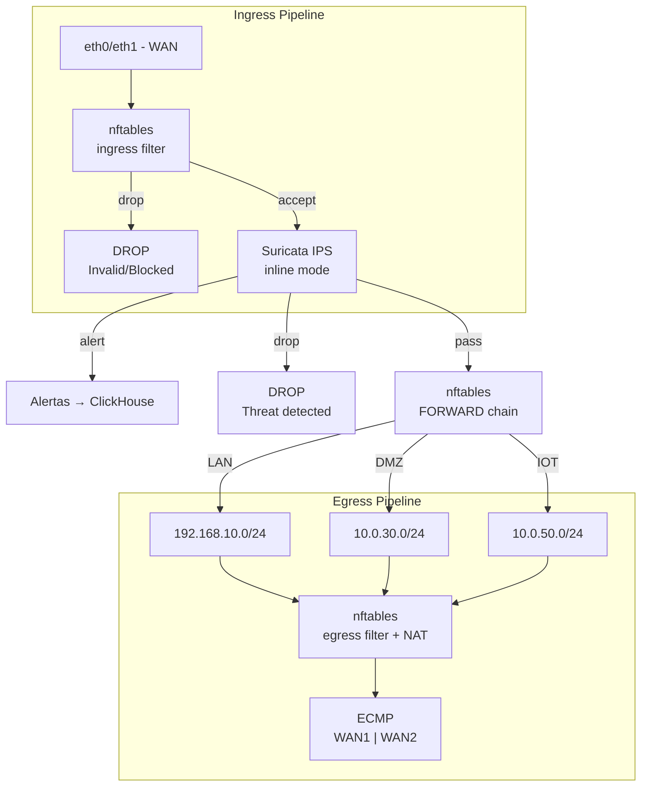

### Estrutura nftables

```bash
#!/usr/sbin/nft -f
# /etc/nftables/mundix.nft

# Limpar regras existentes
flush ruleset

# Tabelas
table inet mundix_filter {
    # Chainsets
    chain input {
        type filter hook input priority 0; policy drop;

        # Loopback
        iifname "lo" accept

        # ICMP rate-limited
        ip protocol icmp limit rate 10/second accept

        # Conexões estabelecidas/relacionadas
        ct state established,related accept

        # Bloquear inválidos
        ct state invalid drop

        # Permitir DNS/DHCP internos
        udp dport {53, 67} ip saddr {192.168.10.0/24, 10.0.0.0/8} accept

        # SSH apenas da rede de gestão
        tcp dport 22 ip saddr 10.0.40.0/24 ct state new accept

        # Dashboard (Traefik + Next.js)
        tcp dport {80, 443} ip saddr 10.0.40.0/24 accept

        # Rate-limit tentativas SSH
        tcp dport 22 ct state new limit rate 5/minute accept

        # Log do que foi dropado
        counter log prefix "nft-input-drop: " drop
    }

    chain forward {
        type filter hook forward priority 0; policy drop;

        # Estado
        ct state established,related accept
        ct state invalid drop

        # LAN → Internet (via Suricata inline)
        ip saddr 192.168.10.0/24 oifname @wan_interfaces queue num 0 bypass

        # DMZ → Internet (via Suricata inline)
        ip saddr 10.0.30.0/24 oifname @wan_interfaces queue num 0 bypass

        # IoT isolado (apenas DNS, sem acesso à LAN)
        ip saddr 10.0.50.0/24 oifname @wan_interfaces tcp dport ! {53,80,443} drop

        # Bloquear IoT → LAN
        ip saddr 10.0.50.0/24 ip daddr 192.168.10.0/24 drop

        # Bloquear LAN → Gestão
        ip saddr 192.168.10.0/24 ip daddr 10.0.40.0/24 drop

        # Log
        counter log prefix "nft-forward-drop: "
    }

    chain output {
        type filter hook output priority 0; policy accept;
    }

    # Sets dinâmicos
    set wan_interfaces {
        type ifname
        elements = { "eth0", "eth1" }
    }
}

table ip mundix_nat {
    chain postrouting {
        type nat hook postrouting priority 100; policy accept;

        # Masquerade para Dual-WAN
        oifname "eth0" masquerade
        oifname "eth1" masquerade
    }
}

table inet mundix_log {
    chain forward_log {
        type filter hook forward priority 50; policy accept;
        log prefix "fwd-track: " group 0 snaplen 64
    }
}
```

### Suricata IPS Inline

```bash
# Habilitar modo inline (NFQUEUE) em /etc/suricata/suricata.yaml
af-packet:
  - interface: eth0
    threads: 2
    cluster-id: 99
    cluster-type: cluster_flow
    defrag: yes
    use-mmap: yes
    tpacket-v2: yes

nfqueue:
  mode: accept
  bypass: yes
  fail-open: no    # NÃO deixar passar tráfego se Suricata cair

# Regras ativas
rule-files:
  - suricata.rules          # Regras da Emerging Threats + Snort
  - local.rules             # Regras customizadas Mundix
```

### Regras Customizadas (local.rules)

```bash
# /var/lib/suricata/rules/local.rules

# Detectar vazamento de CPF/CNPJ (padrão numérico)
alert http $HOME_NET any -> $EXTERNAL_NET any (
  msg:"MUNDIX DLP - Possivel vazamento CPF";
  content:"|3C|cpf|3E|";    # <cpf>
  flow:to_server,established;
  classtype:bad-unknown;
  sid:1000001; rev:1
)

# Alertar acesso a DMZ de fora
alert ip $EXTERNAL_NET any -> $DMZ_NET !80 (
  msg:"MUNDIX - Acesso DMZ porta nao autorizada";
  classtype:web-application-attack;
  sid:1000002; rev:1
)

# Bloquear Tor exit nodes (lista mantida via script)
alert ip [$TOR_EXIT_NODES] any -> $HOME_NET any (
  msg:"MUNDIX - Trafego de Tor Exit Node";
  classtype:trojan-activity;
  sid:1000003; rev:1
)
```

### Pipeline de Logs Suricata

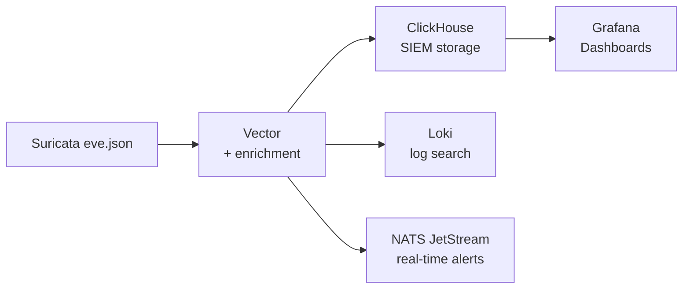


---

## 6. Defesa Técnica nftables

### Princípios de Defesa em Profundidade

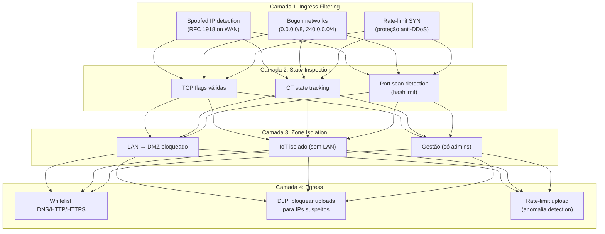

### Anti-Spoofing na WAN

```bash
# Bloquear IPs privados chegando na WAN (RFC 1918 spoofing)
set bogon_src {
    type ipv4_addr
    flags interval
    elements = {
        0.0.0.0/8,
        10.0.0.0/8,
        100.64.0.0/10,
        127.0.0.0/8,
        169.254.0.0/16,
        172.16.0.0/12,
        192.0.0.0/24,
        192.0.2.0/24,
        192.168.0.0/16,
        198.18.0.0/15,
        198.51.100.0/24,
        203.0.113.0/24,
        224.0.0.0/4,
        240.0.0.0/4
    }
}

chain input {
    # Anti-spoofing: drop RFC1918/Bogon na WAN
    iifname { "eth0", "eth1" } ip saddr @bogon_src drop
}
```

### Proteção Anti-DDoS (TCP)

```bash
chain input {
    # Proteção SYN flood
    tcp dport {22, 80, 443} tcp flags syn limit rate 25/second burst 50 packets accept

    # Proteção XMAS scan
    tcp flags (fin|syn|rst|psh|ack|urg) == (fin|syn|rst|psh|ack|urg) drop

    # Proteção NULL scan
    tcp flags (fin|syn|rst|psh|ack|urg) == 0x0 drop

    # Proteção contra fragments (usado em ataques de evasão)
    ip frag-off != 0 drop
}
```

### Isolamento de Redes (Zonas)

```bash
chain forward {
    # Bloquear LAN → Gestão (apenas admin tem acesso)
    ip saddr 192.168.10.0/24 ip daddr 10.0.40.0/24 drop

    # Bloquear IoT → LAN (IoT nunca fala com estação de trabalho)
    ip saddr 10.0.50.0/24 ip daddr 192.168.10.0/24 drop

    # Permitir LAN → DMZ apenas portas específicas
    ip saddr 192.168.10.0/24 ip daddr 10.0.30.0/24 tcp dport ! {80, 443, 8443} drop

    # Bloquear DMZ → LAN (DMZ nunca inicia conexão com LAN)
    ip saddr 10.0.30.0/24 ip daddr 192.168.10.0/24 drop

    # Permitir Gestão → qualquer (admin tem acesso total)
    ip saddr 10.0.40.0/24 accept

    # Egress: apenas DNS/HTTP/HTTPS para LAN
    ip saddr 192.168.10.0/24 tcp dport ! {53, 80, 443} drop
    ip saddr 192.168.10.0/24 udp dport ! 53 drop

    # Rate-limit upload por host (evitar exfiltração)
    ip saddr {192.168.10.0/24, 10.0.50.0/24} limit rate over 5 Mbytes/second log prefix "egress-exfil: " drop
}
```

### Port Scan Detection

```bash
# Detectar port scan: mais de 10 portas diferentes em 60s do mesmo IP
chain forward {
    ip saddr {10.0.30.0/24, 10.0.50.0/24} \
      tcp flags syn \
      limit rate over 10/minute burst 5 packets \
      log prefix "portscan: " \
      add @portscan_block { ip saddr timeout 1h }

    # Bloquear IPs que fizeram portscan
    ip saddr @portscan_block drop
}

set portscan_block {
    type ipv4_addr
    flags dynamic,timeout
    timeout 1h
}
```

### Set Dinâmico de IPs Bloqueados (Blocklist)

```bash
# Bloqueio dinâmico via API/script
set blocklist {
    type ipv4_addr
    flags interval
    counter
}

chain input {
    ip saddr @blocklist drop
}

# Adicionar via CLI
nft add element inet mundix_filter blocklist { 203.0.113.0/24 }

# Adicionar via API do Dashboard (endpoint interno)
curl -X POST http://localhost:3000/api/firewall/block \
  -H "Authorization: Bearer <token>" \
  -d '{"ip": "198.51.100.5", "duration": "24h"}'
```


---

## 7. DNS e DHCP

### Arquitetura DNS + DHCP

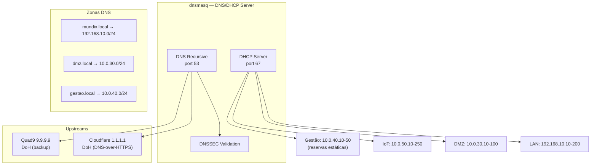

### Configuração dnsmasq

```bash
# /etc/dnsmasq.d/mundix.conf

# === DNS ===
port=53
no-resolv
server=1.1.1.1@853#cloudflare-dns.com     # DNS-over-TLS
server=9.9.9.9@853#dns.quad9.net          # Backup DoT
dnssec
trust-anchor=19036,8,2,49AAC11D7B6F6446...
bogus-priv
domain-needed

# === DNS Local ===
local=/mundix.local/
domain=mundix.local

# Hosts estáticos
address=/firewall.mundix.local/10.0.40.1
address=/dashboard.mundix.local/10.0.30.10
address=/grafana.mundix.local/10.0.30.11
address=/wazuh.mundix.local/10.0.30.12
address=/keycloak.mundix.local/10.0.30.13
address=/vault.mundix.local/10.0.30.14
address=/minio.mundix.local/10.0.30.15

# === DHCP por zona ===
# LAN (Colaboradores)
dhcp-range=eth2,192.168.10.10,192.168.10.200,12h
dhcp-option=eth2,3,192.168.10.1    # Gateway (Mundix)
dhcp-option=eth2,6,192.168.10.1    # DNS server (Mundix)

# DMZ
dhcp-range=eth3,10.0.30.10,10.0.30.100,24h
dhcp-option=eth3,3,10.0.30.1
dhcp-option=eth3,6,10.0.30.1

# Gestão (reservas apenas)
dhcp-range=eth4,10.0.40.10,10.0.40.50,48h
dhcp-host=aa:bb:cc:dd:ee:01,10.0.40.10,admin-pc,infinite
dhcp-host=aa:bb:cc:dd:ee:02,10.0.40.11,devops-01,infinite

# IoT/Guest
dhcp-range=eth5,10.0.50.10,10.0.50.250,4h
dhcp-option=eth5,3,10.0.50.1
dhcp-option=eth5,6,10.0.50.1

# === Segurança ===
dhcp-authoritative
dhcp-leasefile=/var/lib/misc/dnsmasq.leases
dhcp-script=/usr/local/bin/dhcp-hook.sh    # Hook para logging
```

### DHCP Hook (logging de eventos)

```bash
#!/bin/bash
# /usr/local/bin/dhcp-hook.sh
# Enviado por dnsmasq em cada atribuição/renovação de IP

ACTION=$1
MAC=$2
IP=$3
HOSTNAME=$4

TIMESTAMP=$(date -Iseconds)

# Log para observabilidade
echo "${TIMESTAMP} DHCP_${ACTION} mac=${MAC} ip=${IP} host=${HOSTNAME}" \
  | logger -t dhcp-event

# Enviar para Vector/NATS para dashboards
curl -s -X POST http://localhost:4222/subject/dhcp.events \
  -d "{\"action\":\"${ACTION}\",\"mac\":\"${MAC}\",\"ip\":\"${IP}\",\"hostname\":\"${HOSTNAME}\",\"ts\":\"${TIMESTAMP}\"}"
```

### DNS Sinkhole (Bloqueio de Domínios Maliciosos)

```bash
# /etc/dnsmasq.d/adservers.conf
# Atualizado diariamente via script (Pi-hole blocklists convertidas)

# Sinkhole → retorna NXDOMAIN para domínios maliciosos
address=/doubleclick.net/0.0.0.0
address=/googlesyndication.com/0.0.0.0
address=/adservice.google.com/0.0.0.0
address=/telemetry.microsoft.com/0.0.0.0
# ... (listas mantidas por script)
```

```bash
# /usr/local/sbin/update-blocklists.sh (cron diário)
#!/bin/bash
# Atualiza blocklists de domínios maliciosos
# Fontes: oisd.nl, haugene, StevenBlack

BLOCKLIST_DIR="/etc/dnsmasq.d/blocklists"
mkdir -p "$BLOCKLIST_DIR"

# StevenBlack hosts (MIT license)
curl -s https://raw.githubusercontent.com/StevenBlack/hosts/master/hosts \
  | grep -E "^0\.0\.0\.0" \
  | awk '{print "address=/"$2"/0.0.0.0"}' \
  > "$BLOCKLIST_DIR/stevenblack.conf"

# Recarregar dnsmasq
systemctl reload dnsmasq
echo "$(date): Blocklists atualizadas" >> /var/log/dnsmasq-blocklists.log
```


---

## 8. Telemetria e Observabilidade

### Pipeline de Telemetria

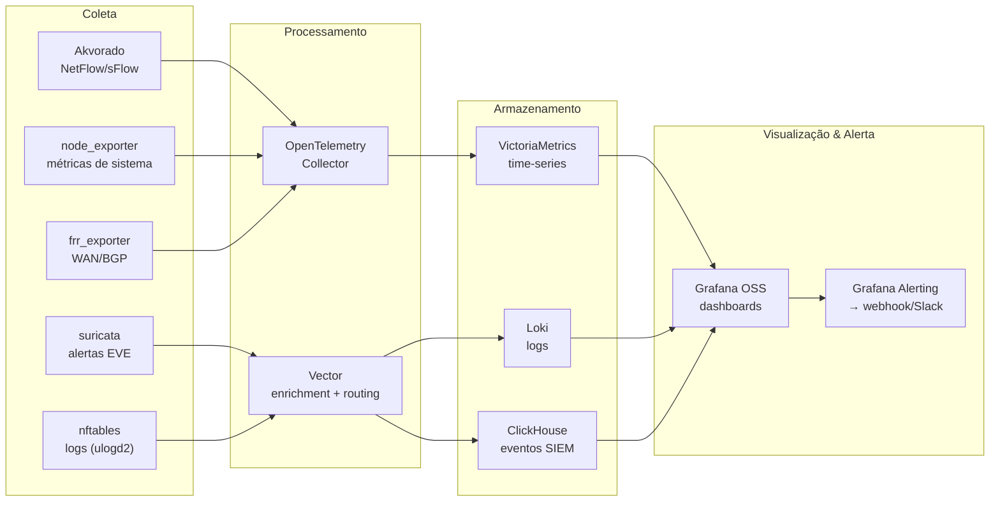

### Akvorado (Flow Collector)

```yaml
# /etc/akvorado/config.yaml
reporting:
  http:
    listen: :8080

input:
  flow:
    inputs:
      - type: netflow
        listen: 0.0.0.0:2055
        workers: 4

  classifier:
    # Classificar tráfego por zona de rede
    rules:
      - source: 192.168.10.0/24
        exporter-group: Lan
      - source: 10.0.30.0/24
        exporter-group: Dmz
      - source: 10.0.40.0/24
        exporter-group: Gestao
      - source: 10.0.50.0/24
        exporter-group: Iot

output:
  clickhouse:
    servers:
      - localhost:9000
    database: akvorado
    flush-interval: 5s
```

### VictoriaMetrics (Time-Series)

```bash
# Systemd service override para VictoriaMetrics single-node
[Service]
ExecStart=/usr/local/bin/victoria-metrics \
  -storageDataPath=/var/lib/victoria-metrics \
  -retentionPeriod=90d \
  -httpListenAddr=127.0.0.1:8428 \
  -selfScrapeInterval=15s
```

### Alertas Críticos (Grafana)

| Alerta | Condição | Severidade | Ação |
|--------|----------|------------|------|
| WAN_down | `up{job="frr"} == 0` | Critical | Slack + PagerDuty |
| Throughput_ano | `rate(traffic_bytes[5m]) > 2 * avg` | Warning | Slack |
| Disk_90 | `node_filesystem_avail < 10%` | Warning | Slack |
| IPS_block_spike | `suricata_alerts > 100/min` | High | Block + Slack |
| DNS_failure_rate | `dns_fail / dns_total > 5%` | Warning | Slack |

---

## 9. SIEM e XDR

### Arquitetura Wazuh + ClickHouse

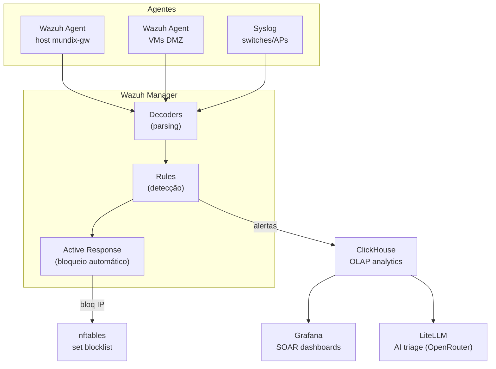

### Regras Wazuh (custom.xml)

```xml
<!-- /var/ossec/etc/rules/local_rules.xml -->
<group name="mundix,custom">

  <!-- Acesso SSH falho (brute-force detection) -->
  <rule id="100100" level="7">
    <if_sid>5712</if_sid>
    <match>sshd.*Failed password</match>
    <description>SSH brute-force attempt: $(srcip)</description>
    <group>authentication_failed,pci_dss_10.2.4</group>
  </rule>

  <!-- Portscan detectado pelo nftables -->
  <rule id="100101" level="10">
    <if_sid>1002</if_sid>
    <match>portscan:</match>
    <description>Portscan detectado: $(srcip)</description>
    <group>recon,attack.t1046</group>
  </rule>

  <!-- Upload anômalo (possível exfiltração) -->
  <rule id="100102" level="12">
    <if_sid>1002</if_sid>
    <match>egress-exfil:</match>
    <description>Tráfego de saída anômalo: $(srcip)</description>
    <group>exfiltration,attack.t1048</group>
  </rule>

  <!-- Vazamento DLP (CPF/CNPJ em upload) -->
  <rule id="100103" level="15">
    <if_sid>86001</if_sid>
    <match>DLP-CPF-DETECT</match>
    <description>ALERTA DLP: CPF/CNPJ em tráfego de saída</description>
    <group>dlp,pci_dss_3.2,lgpd_art46</group>
  </rule>

</group>
```

### Active Response (Bloqueio Automático)

```xml
<!-- /var/ossec/etc/ossec.conf -->
<command>
  <name>block-ip</name>
  <executable>block-ip.sh</executable>
  <extra_args>nft</extra_args>
  <timeout_allowed>yes</timeout_allowed>
</command>

<active-response>
  <command>block-ip</command>
  <location>local</location>
  <rules_id>100101,100102,100103</rules_id>
  <timeout>3600</timeout>  <!-- 1 hora -->
</active-response>
```

```bash
#!/bin/bash
# /var/ossec/active-response/bin/block-ip.sh

ACTION=$1
USER=$2
IP=$3
ACTION_ID=$4

case "$ACTION" in
  add)
    nft add element inet mundix_filter blocklist { "$IP" timeout 1h }
    echo "$(date) active-response: BLOCK $IP (rule $ACTION_ID)" >> /var/log/active-response.log
    ;;
  delete)
    nft delete element inet mundix_filter blocklist { "$IP" }
    echo "$(date) active-response: UNBLOCK $IP" >> /var/log/active-response.log
    ;;
esac
```

### Integração AI (LiteLLM + OpenRouter)

```python
# Mundix AI Triage — usa OpenRouter para análise automática de alertas
# /opt/mundix360/ai/triage.py

import httpx
from litellm import completion

OPENROUTER_MODEL = "anthropic/claude-3.5-sonnet"

def triage_alert(alert: dict) -> str:
    prompt = f"""
    Analise o seguinte alerta de segurança e responda em PT-BR:
    - Tipo: {alert['rule']['description']}
    - Source IP: {alert['srcip']}
    - Timestamp: {alert['timestamp']}
    - Contexto: {alert.get('full_log', 'N/A')}
    
    Perguntas:
    1. Qual é a severidade real (0-15)?
    2. É falso positivo?
    3. Que ação automatizada é recomendada?
    4. Esta ação se enquadra em qual MITRE ATT&CK framework?
    """
    
    response = completion(
        model=OPENROUTER_MODEL,
        messages=[{"role": "user", "content": prompt}],
        api_base="https://openrouter.ai/api/v1",
        api_key=os.environ["OPENROUTER_API_KEY"]
    )
    return response['choices'][0]['message']['content']
```


---

## 10. DLP — Detecção de Dados Sensíveis

### Objetivos

- Detectar vazamento de CPF, CNPJ, RG, dados bancários, cartões de crédito
- Alertar e opcionalmente bloquear exfiltração de dados sensíveis
- Manter logs para compliance LGPD (com pseudonimização após 1 ano)

### Pipeline DLP

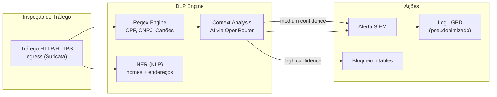

### Padrões Regex DLP

```python
# /opt/mundix360/dlp/patterns.py

DLP_PATTERNS = {
    "CPF": r'\b\d{3}\.\d{3}\.\d{3}-\d{2}\b',
    "CNPJ": r'\b\d{2}\.\d{3}\.\d{3}/\d{4}-\d{2}\b',
    "RG": r'\b\d{1,2}\.?\d{3}\.?\d{3}-?\d{1}?\b',
    "CARTAO_CREDITO": r'\b(?:4[0-9]{12}(?:[0-9]{3})?|5[1-5][0-9]{14}|3[47][0-9]{13})\b',
    "EMAIL": r'\b[A-Za-z0-9._%+-]+@[A-Za-z0-9.-]+\.[A-Z|a-z]{2,}\b',
    "PLACA_VEICULO": r'\b[A-Z]{3}-?\d[A-Z0-9]\d{2}\b',
    "TELEFONE_BR": r'\(\d{2}\)\s?\d{4,5}-?\d{4}\b',
    "CEP": r'\b\d{5}-?\d{3}\b',
}

def scan_content(text: str) -> list:
    """Retorna lista de tipos de dados sensíveis encontrados"""
    results = []
    for dtype, pattern in DLP_PATTERNS.items():
        if re.search(pattern, text):
            results.append(dtype)
    return results
```

### Suricata + DLP Integration

```bash
# Regra Suricata para capturar POST bodies com potencial CPF
# /var/lib/suricata/rules/dlp.rules

alert http $HOME_NET any -> $EXTERNAL_NET any (
  msg:"DLP-CPF-DETECT - Possivel vazamento de CPF";
  flow:to_server,established;
  http.method; content:"POST";
  http.request_body;
  pcre:"/\d{3}\.\d{3}\.\d{3}-\d{2}/";
  classtype:policy-violation;
  sid:2000001; rev:1;
)

alert http $HOME_NET any -> $EXTERNAL_NET any (
  msg:"DLP-CNPJ-DETECT - Possivel vazamento de CNPJ";
  flow:to_server,established;
  http.method; content:"POST";
  http.request_body;
  pcre:"/\d{2}\.\d{3}\.\d{3}\/\d{4}-\d{2}/";
  classtype:policy-violation;
  sid:2000002; rev:1;
)

alert http $HOME_NET any -> $EXTERNAL_NET any (
  msg:"DLP-CARTAO-DETECT - Numero de cartao em upload";
  flow:to_server,established;
  http.method; content:"POST";
  http.request_body;
  pcre:"/(?:4[0-9]{12}(?:[0-9]{3})?|5[1-5][0-9]{14})/";
  classtype:policy-violation;
  sid:2000003; rev:1;
)
```

### Pseudonimização LGPD

```python
# /opt/mundix360/dlp/pseudonymize.py
# Após 1 ano de retenção, dados são pseudonimizados

import hashlib
import hmac

def pseudonymize_cpf(cpf: str, secret_key: str) -> str:
    """Gera hash HMAC do CPF mantendo correlação sem expor dado original"""
    return hmac.new(
        key=secret_key.encode(),
        msg=cpf.encode(),
        digestmod=hashlib.sha256
    ).hexdigest()[:16]

# Exemplo:
# CPF original: 123.456.789-09
# Pseudonimizado: a1b2c3d4e5f67890
# Impossível reverter sem a chave, mas ainda correlacionável
```

### Retenção LGPD

| Tipo de Dado | Retenção Raw | Pseudonimização | Retenção Final |
|-------------|--------------|-----------------|----------------|
| Alertas DLP | 1 ano | HMAC-SHA256 | 5 anos |
| Logs de fluxo | 30 dias | N/A | Deletado |
| IPs de origem | 90 dias | Hashed | 5 anos |
| Trilha auditoria | — | Nunca | 5 anos (imutável) |

---

## 11. Automação e IaC

### Stack de Automação

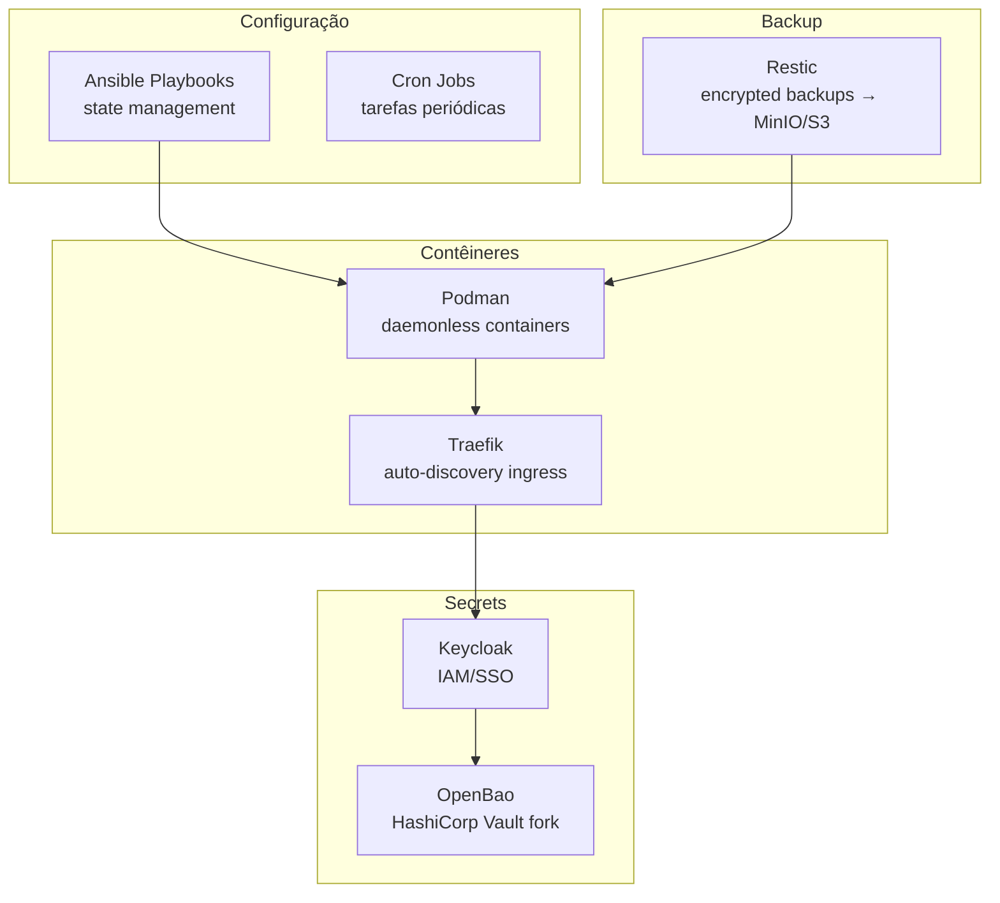

### Ansible — Estrutura de Playbooks

```yaml
# /opt/mundix360/ansible/site.yml
---
- hosts: mundix_gw
  become: yes
  vars_files:
    - vars/secrets.yml    # Encrypted with ansible-vault

  roles:
    - name: system_base
      # timezone, users, sudoers, hardening

    - name: network_setup
      # nftables rules, ECMP routes, BFD config

    - name: dns_dhcp
      # dnsmasq configuration and restart

    - name: firewall
      # Suricata rules, nftables sets, failover scripts

    - name: observability
      # Akvorado, VictoriaMetrics, Grafana, Vector, Loki

    - name: siem
      # Wazuh manager, ClickHouse, Active Response

    - name: dlp
      # DLP patterns, Suricata integration

    - name: dashboard
      # Next.js build, Traefik routing

    - name: secrets
      # OpenBao, Keycloak, MinIO

    - name: backup
      # Restic cron, MinIO/S3 target
```

### Exemplo: Playbook para Atualização de Regras Suricata

```yaml
# /opt/mundix360/ansible/playbooks/update-suricata.yml
---
- hosts: mundix_gw
  become: yes
  tasks:
    - name: Baixar últimas regras Emerging Threats
      get_url:
        url: "https://rules.emergingthreats.net/open/suricata-7.0.3/emerging.rules.tar.gz"
        dest: /tmp/emerging.rules.tar.gz

    - name: Extrair regras
      unarchive:
        src: /tmp/emerging.rules.tar.gz
        dest: /var/lib/suricata/rules/
        remote_src: yes

    - name: Copiar regras customizadas Mundix
      copy:
        src: files/suricata/{{ item }}
        dest: /var/lib/suricata/rules/
        mode: '0644'
      loop:
        - local.rules
        - dlp.rules

    - name: Atualizar suricata.yaml rule-files
      lineinfile:
        path: /etc/suricata/suricata.yaml
        regexp: '^\s+-\s+local\.rules'
        line: '  - local.rules'

    - name: Validar regras Suricata
      command: suricata -T -c /etc/suricata/suricata.yaml
      register: suri_test
      failed_when: suri_test.rc != 0

    - name: Recarregar Suricata (graceful)
      service:
        name: suricata
        state: reloaded

    - name: Log de atualização
      debug:
        msg: "Suricata rules atualizadas em {{ ansible_date_time.iso8601 }}"
```

### Cron Jobs (Tarefas Periódicas)

```bash
# /etc/cron.d/mundix-automation
# Mundix Security 360 — automações programadas

# Atualizar blocklists DNS (diário às 03:00)
0 3 * * * root /usr/local/sbin/update-blocklists.sh

# Rotacionar logs Wazuh antigos (semanal domingo 04:00)
0 4 * * 0 root /usr/local/sbin/rotate-wazuh-logs.sh

# Backup Restic para MinIO (diário às 02:00)
0 2 * * * root /usr/local/sbin/mundix-backup.sh

# Pseudonimizar dados DLP com >1 ano (mensal dia 1 às 01:00)
0 1 1 * * root python3 /opt/mundix360/dlp/pseudonymize_old.py

# Atualizar regras Emerging Threats (semanal segunda 05:00)
0 5 * * 1 root ansible-playbook /opt/mundix360/ansible/playbooks/update-suricata.yml

# Health check do sistema (a cada 15 min)
*/15 * * * * root /usr/local/sbin/health-check.sh

# Limpar logs de fluxo >30 dias (diário às 06:00)
0 6 * * * root find /var/log/akvorado -name "*.log" -mtime +30 -delete
```

### Restic Backup (Criptografado)

```bash
#!/bin/bash
# /usr/local/sbin/mundix-backup.sh

export RESTIC_REPOSITORY=s3:http://minio.mundix.local/backups/mundix-gw
export RESTIC_PASSWORD_COMMAND="openbao kv get -field=password secret/restic"
export AWS_ACCESS_KEY_ID=$(openbao kv get -field=access_key secret/minio)
export AWS_SECRET_KEY=$(openbao kv get -field=secret_key secret/minio)

# Backup componentes críticos
restic backup \
  /etc/nftables \
  /etc/dnsmasq.d \
  /var/lib/suricata/rules \
  /opt/mundix360 \
  /var/lib/victoria-metrics \
  /var/ossec/etc \
  --tag system-cfg \
  --tag $(date +%Y-%m-%d)

# Manter apenas: 7 diários + 4 semanais + 12 mensais
restic forget --keep-daily 7 --keep-weekly 4 --keep-monthly 12

# Verificar integridade
restic check

echo "$(date): Backup completo e verificado" >> /var/log/restic-backup.log
```


---

## 12. Compliance LGPD/ANPD

### Mapeamento LGPD — Artigos Relevantes

| Artigo LGPD | Requisito | Implementação Mundix |
|------------|-----------|---------------------|
| **Art. 6, I** | Finalidade legítima | Logs com propósito documentado |
| **Art. 6, II** | Necessidade (data minimization) | Apenas metadados essenciais retidos |
| **Art. 6, VI** | Transparência | Dashboard com métricas de uso |
| **Art. 7, V** | Consentimento (quando aplicável) | Termos de uso para rede IoT/Guest |
| **Art. 9** | Direito de acesso | Exportação de dados por usuário (CSV/JSON) |
| **Art. 12** | Pseudonimização | HMAC-SHA256 após período de retenção |
| **Art. 33** | Transferência internacional | Dados armazenados apenas no Brasil (MinIO local) |
| **Art. 37** | Nomeação de DPO | Documentado no sistema (contato DPO) |
| **Art. 46** | Segurança técnica | Criptografia, acesso restrito, logs imutáveis |
| **Art. 48** | Notificação de incidentes | Alertas ANPD automáticos (via API) |
| **Art. 50** | Código de conduta | Políticas de segurança documentadas |

### Trilha de Auditoria Imutável

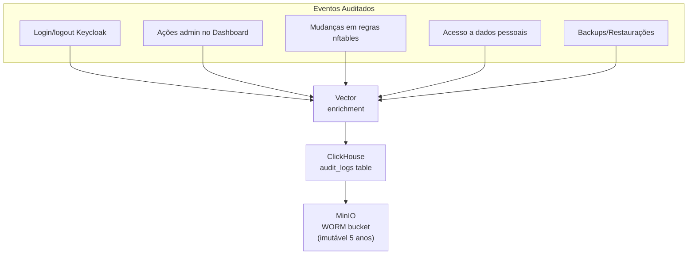

```sql
-- Schema ClickHouse para logs de auditoria
CREATE TABLE audit_logs (
    timestamp DateTime64(3),
    event_type String,
    actor_id String,        -- UUID do usuário (não CPF/email)
    actor_ip IPv4,
    action String,
    resource String,
    outcome Enum('success' = 1, 'failure' = 2),
    metadata JSON,
    hash_chain String       -- SHA256(prev_hash + current_event) — blockchain-like
) ENGINE = MergeTree()
PARTITION BY toYYYYMM(timestamp)
ORDER BY (timestamp, actor_id)
TTL timestamp + INTERVAL 5 YEAR;
```

### Relatório de Incidentes (ANPD)

```python
# /opt/mundix360/compliance/anpd_report.py
# Gera notificação automática para ANPD em caso de incidente relevante

import json
from datetime import datetime

def generate_anpd_notification(incident: dict) -> dict:
    """
    Conforme Resolução CD/ANPD nº 15/2024
    Notificação deve conter:
    - Natureza dos dados afetados
    - Informações dos titulares envolvidos
    - Medidas técnicas adotadas
    - Riscos relacionados
    - Medidas para reverter/mitigar
    """
    
    report = {
        "notificador": {
            "cnpj": "XX.XXX.XXX/0001-XX",  # CNPJ da empresa
            "nome": "Nome da Empresa",
            "dpo_email": "dpo@empresa.com.br",
            "dpo_telefone": "+55 11 9999-9999"
        },
        "incidente": {
            "data_ocorrencia": incident["timestamp"],
            "data_descoberta": datetime.now().isoformat(),
            "descricao": incident["description"],
            "natureza_dados": incident["data_types"],  # ["CPF", "email", ...]
            "titulares_afetados": incident["affected_count"],
            "gravidade": incident["severity"]
        },
        "medidas_adotadas": {
            "bloqueio_automatico": incident["auto_blocked"],
            "investigacao_iniciada": True,
            "containment_actions": incident["actions_taken"]
        },
        "risco_ao_titular": incident["risk_assessment"]
    }
    
    # Enviar para sistema ANPD (via API ou gerar PDF)
    return report
```

### Data Minimization (Minimização de Dados)

| Dado | Coleta | Retenção Raw | Pseudonimizado | Eliminação |
|------|--------|--------------|----------------|------------|
| Logs de fluxo (NetFlow) | Sim | 30 dias | — | Deletado |
| DNS queries | Sim | 7 dias | — | Deletado |
| Alertas Suricata | Sim | 90 dias | 1 ano | 5 anos |
| Eventos DLP | Sim | 1 ano | HMAC | 5 anos |
| Auditoria (quem acessou) | Sim | — | — | 5 anos (imutável) |
| IPs de origem | Parcial | 30 dias | Hash | 5 anos |
| Tráfego bruto (pcap) | Não | — | — | — |
| Biometria | Não | — | — | — |

### Políticas de Acesso (Keycloak)

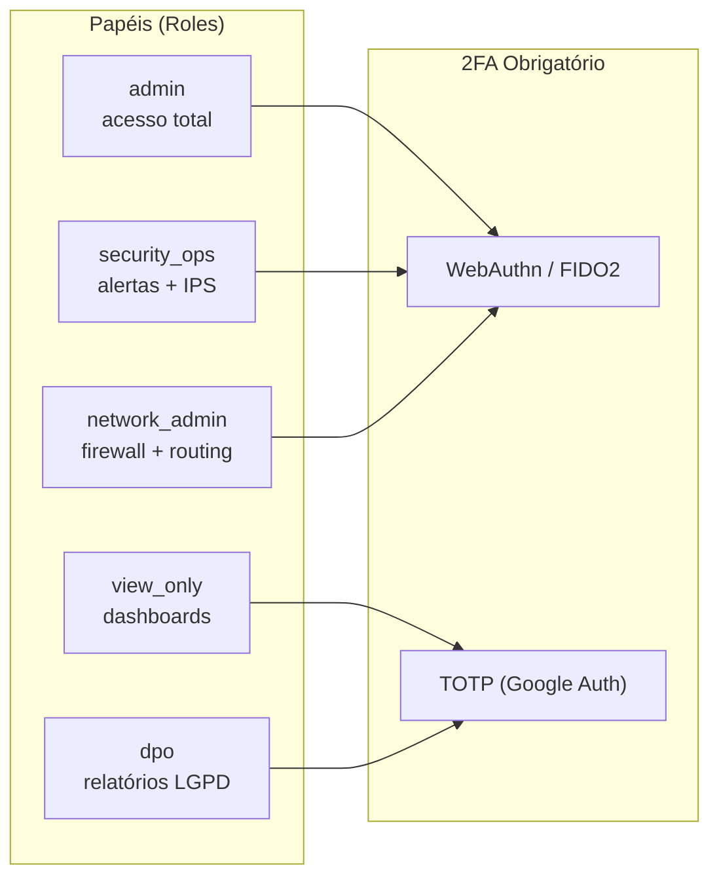

### LGPD Self-Service (Dashboard)

| Funcionalidade | End-user | Admin |
|----------------|----------|-------|
| Solicitar portabilidade | ✅ | — |
| Solicitar exclusão | ✅ | — |
| Ver dados coletados | ✅ | Ver todos |
| Exportar relatórios | CSV/JSON | CSV/JSON/PDF |
| Registrar consentimento | ✅ | Editar base legal |
| Notificar ANPD | — | ✅ |

---

## Anexos

### A. Cronograma de Implementação (Fases)

| Fase | Duração | Escopo |
|------|---------|--------|
| **Fase 1: Foundation** | 2 semanas | Ubuntu setup, nftables, dnsmasq, ECMP |
| **Fase 2: Observabilidade** | 3 semanas | Akvorado, VictoriaMetrics, Grafana, Vector, Loki |
| **Fase 3: SIEM** | 3 semanas | Wazuh, ClickHouse, Active Response |
| **Fase 4: Dashboard** | 4 semanas | Next.js, Shadcn/ui, todas as telas unificadas |
| **Fase 5: DLP + Compliance** | 3 semanas | DLP engine, pseudonimização, auditoria imutável |
| **Total** | **~15 semanas** | |

### B. Portas e Serviços Expostos

| Serviço | Porta | Zona | Acesso |
|---------|-------|------|--------|
| SSH | 22 | Gestão (eth4) | Apenas admins |
| Dashboard HTTPS | 443 | Gestão | Admins/SecOps |
| Grafana | 3000 | DMZ | SSO via Keycloak |
| Wazuh Manager | 55000 | DMZ | Agentes internos |
| DNS | 53 | LAN/DMZ/IoT | Todos internos |
| DHCP | 67 | LAN/DMZ/IoT | Todos internos |
| HTTP/HTTPS | 80/443 | DMZ | Internet → DMZ only |
| NetFlow | 2055/4739 | Loopback | Localhost only |

### C. Licenças de Software (Verificação)

```bash
# /opt/mundix360/scripts/verify-licenses.sh
echo "Verificação de licenças 100% open source:"
echo "- nftables: $(dpkg -s nftables | grep -i license)"
echo "- Suricata: $(suricata --version | grep -i version)"
echo "- dnsmasq: $(dnsmasq --version | head -2)"
echo "- Wazuh: $(wazuh-manager --version)"
# Todos: MIT / Apache 2.0 / GPL / BSD / MPL-2.0
# Nenhum: BSL, SSPL, Elastic License, Commons Clause
```

---

## Diagrama Geral

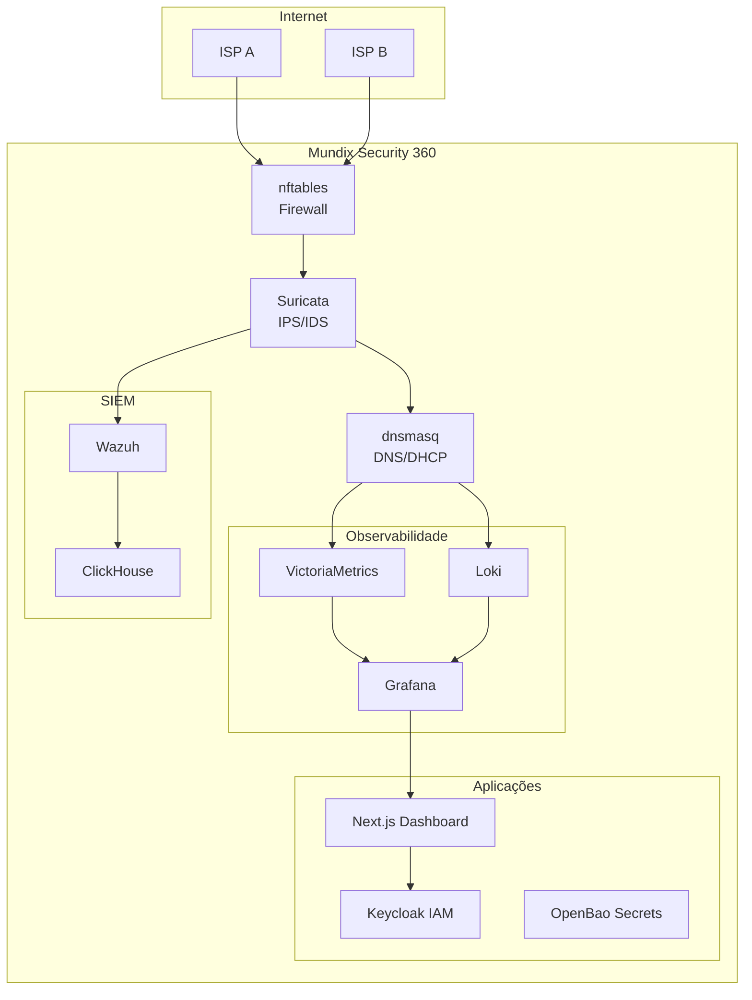

---

> **Autor:** Mundix Security Team
> **Contato:** security@mundix.local
> **Changelog:** Veja `/opt/mundix360/CHANGELOG.md`

